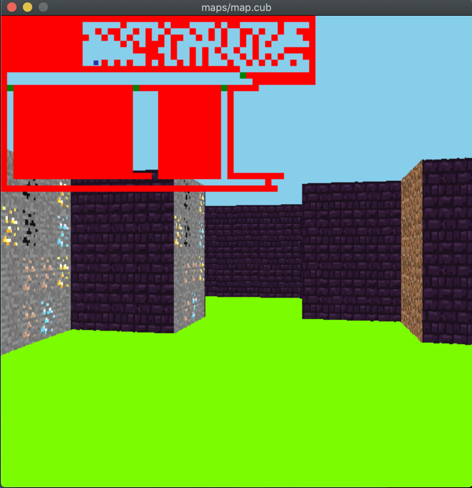

<h1 align="center"> 📦 cub3D  </h1>

<h2 align="center">Simple 3D game using ray casting like Wolfeinstein</h2>
<br>

<hr>

<!-- PROJECT LOGO -->
<br />


<!-- ABOUT THE PROJECT -->
## About The Project



This project is inspired by the world-famous eponymous 90's game, which was the first FPS ever. It will enable you to explore ray-casting. Your goal will be to make a dynamic view inside a maze, in which you'll have to find your way. 

<!-- GETTING STARTED -->
## About

This is an example of how you may give instructions on setting up your project locally.
To get a local copy up and running follow these simple example steps.

#### Skills
- Rigor
- Imperative programming
- Graphics
- Unix
- Algorithms & AI

### Usage

1. Clone the repo
   ```sh
   git clone https://github.com/kpaxlive/cub3D.git
   ```
2. Compile all source code with Makefile in root folder
   ```sh
   make
   ```
3. Run `cub3D` with any map of your choice
   ```sh
   ./cub3D maps/map.cub
   ```

<!-- ACKNOWLEDGMENTS -->
## Acknowledgments

* [Raycasting Algorithms](https://youtu.be/ebzlMOw79Yw)
* [Wolfenstein 3D's map renderer](https://youtu.be/eOCQfxRQ2pY)
* [2D Raycasting](https://youtu.be/TOEi6T2mtHo)
* [Rendering Raycasting](https://youtu.be/vYgIKn7iDH8)
